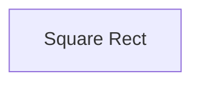

# Łączenie rutera Mikrotik z AWX
## 1. Pojęcia

```mermaid
graph LR
A[Square Rect]
```
## 2. Schemat działania

```mermaid
graph LR
A1[Host] -- Credential -->B(Interface)
A2[Host] -- Credential -->B
A3[Host] -- Credential -->B
B --> C((TEMPLATE))
C2[(GITHUB)] --> P([Project])
P --> C
```
