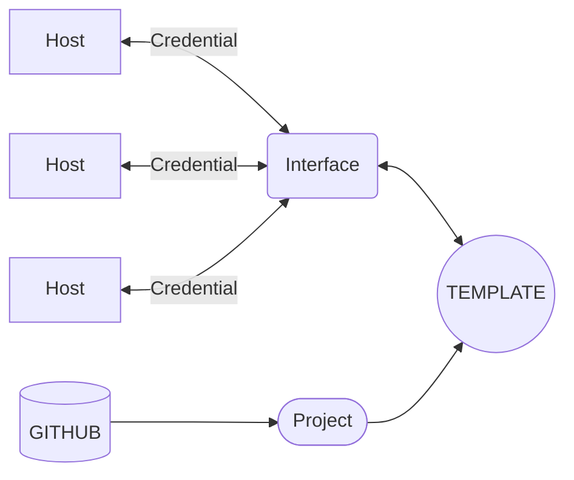

# Łączenie rutera Mikrotik z AWX

## 1. Pojęcia
* __host__ - pojedyńcze urządzenie
* __interface__ - zbiór urządzeń (hostów)
* __credential__ - dane do logowania
* __project__ - łaczy playbooki z AWX
* __template__ - tworzy autmatyzację łącząc interface z projectem.

## 2. Schemat działania


## 3. Tworzenie hosta
> Klikamy ADD

> Uzupełniamy poszczególne pola
* **Name** - adres ip serwera
* **Desctiption** - nazwa wyświetlana w interfejsie

> Klikamy SAVE
## 4. Tworzenie invetory
> Klikamy ADD

> Uzupełniamy poszczególne pola
* **Name** - nazwa wyświetlana w aplikacji (może to być nazwa firmy)
* **Organization** - nazwa organizacji/firmy (można default, jeśli nie będzie się nikomu udostępniać AWX; służy bardziej do grupowania użytkowników)
* **Variables** - wklejamy poniższy kod:
```
---
ansible_connection: network_cli
ansible_network_os: community.routeros.routeros
ansible_ssh_common_args: '-o StrictHostKeyChecking=no'
```
> Omówienie każdej linijki:
> 1. Określa sposób komunikacji Ansible z Mikrotikiem
> 2. Wskazuje, że system na docelowym urządzeniu to MikroTik Router OS
> 3. Rozwiązuje problem komunikatu o weryfikacji klucza hosta SSH

> Klikamy SAVE
## 5. Stworzenie repozytorium na GitHub
> w nim przechowywujemy wszystkie playbooki
> tworzymy folder o nazwie ```collections```
> tworzymy plik ```requirements.yml```
> wklejamy do niego poniższy kod
```
---
collections:
- name: community.routeros
```
> informuje on o Ansible, że do wykonania operacji potrzebna jest kolekcja ```comunity.routeros```

> pozostałe Playbooki umieszczamy w nadrzędnym folderze.

> tworzymy Playbook, który zainstaluje nam SSH
!Tu warto zauważyć, że nie mamy jeszcze przygotowanego sposobu pobierania klucza prywatnego z komputera
## 6. Tworzenie Project
> Klikamy ADD

> Uzupełniamy poszczególne pola
* **Name** - nazwa wyświetlana w aplikacji (może to być opis procesu, jaki ma wykonać)
* **Organization** - nazwa organizacji/firmy (można default
* **Source Control Type** - wybieramy GIT
* **Source Control URL** - wklejamy link do repozytorium (np. https://github.com/uzytkownik/repozytorium.git)
# AUTOMATYZACJA
> SKRYPT DOMYŚLNIE BĘDZIE TWORZYŁ NOWEGO UŻYTKOWNIKA, NADAWAŁ MU I ADMINISTRATOROWI LOGOWANIE PRZEZ SSH
> AKTUALNIE SKRYPT NADAJE TYLKO KLUCZ SSH DLA WYBRANEGO UŻYTKOWNIKA

> tworzymy playbooka 
```
---
- name: Tworzenie uzytkownika i import klucza SSH na MikroTik
  hosts: all
  gather_facts: false

  vars:
    new_user_name: admin #TUTAJ WPISUJEMY NAZWĘ UŻYTKOWNIKA KTÓREMU CHCEMY NADAĆ KLCZ SSH

  tasks:
    - name: Utwórz plik z kluczem SSH na urządzeniu
      community.routeros.command:
        commands:
          - "/file print file=temp_key.txt"

    - name: Odczekaj chwilę na zapisanie pliku na dysku
      ansible.builtin.pause:
        seconds: 2

    - name: Wpisz klucz SSH do pliku
      community.routeros.command:
        commands:
          - "/file set temp_key.txt contents=\"{{ public_key_text }}\""

    - name: Import klucza SSH z utworzonego pliku
      community.routeros.command:
        commands:
          - "/user ssh-keys import public-key-file=temp_key.txt user={{ new_user_name }}"

    - name: Usuń plik tymczasowy
      community.routeros.command:
        commands:
          - "/file remove temp_key.txt"
```

> Klikamy SAVE
## 7. Tworzenie Credentials
> Stworzymy od razu 2 różne wersje logowania (przez hasło oraz przez Klucz SSH)
>
> Klikamy ADD
### Przez Hasło
> Uzupełniamy poszczególne pola
* **Name** - nazwa wyświetlana w aplikacji (może to być nazwa firmy)
* **Credential Type** - wybrać ```Machine```
* **Nazwa Użytkownika** - nazwa użytkownika w ruterze (przeważnie admin)
* **Hasło** - hasło użytkownika.

### Przez Klucz
> Uzupełniamy poszczególne pola
* **Name** - nazwa wyświetlana w aplikacji (może to być nazwa firmy)
* **Credential Type** - wybrać ```Machine```
* **Nazwa Użytkownika** - nazwa użytkownika w ruterze (przeważnie admin)
* **Signed SSH Certificate** - przeciągnąć albo wkleić prywatny klucz SSH

## 8. Połącznie wszystkiego w Template
> Klikamy ADD i uzupełniamy poszczególne pola
* **Name** - nazwa opisująca Zdarzenie (np. nazwa firmy + opis procesu)
* **Job Type** - wybieramy run
* **Inventory** - wybieramy Nasze Inventory
* **Project** - wybieramy Nasz Project
* **Playbook** -
! TU BĘDZIE, ŻE WYBIERAMY SKRYPT, KTÓRY INSTALUJE SSH KEY
* **Credentials** - wybieramy Nasze Crednetial (logujący się przez hasło)
> Klikamy SAVE
## 9. Uruchomienie
> Wybieramy nasz Template i klikamy Launch.

## 10. Po instalacji
> Możemy usunąć Credential z logowaniem przez hasło
> Podczas następnych użyć możemy zmieniać Playbooki.

# Gotowe.
