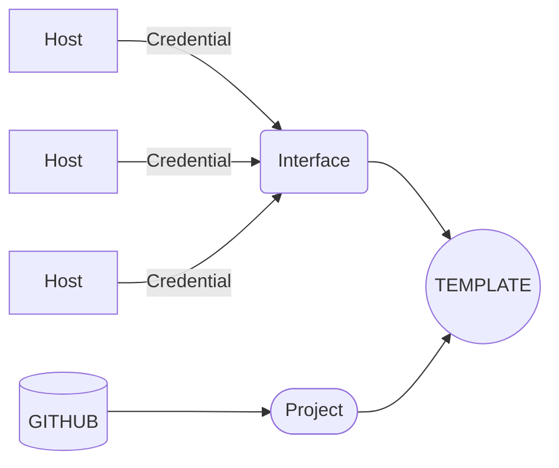

# Łączenie rutera Mikrotik z AWX
## 1. Pojęcia
* __host__ - pojedyńcze urządzenie
* __interface__ - zbiór urządzeń (hostów)
* __credential__ - dane do logowania
* __project__ - łaczy playbooki z AWX
* __template__ - tworzy autmatyzację łącząc interface z projectem
## 2. Schemat działania

